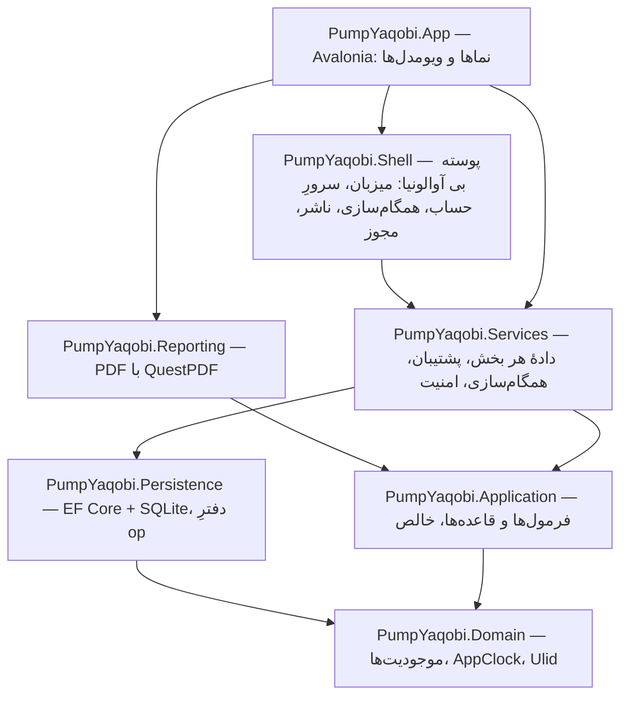
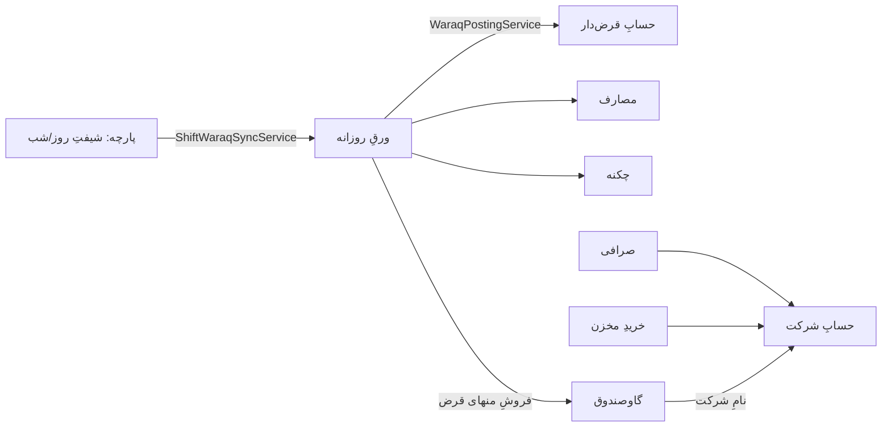

# معماریِ برنامهٔ «پمپ بنزین» — در دو صفحه

> هر ادعا مسیرِ فایل دارد؛ `DocPathsTests` می‌سنجد که هر مسیرِ نام‌برده در این
> سند و در `README.md` واقعاً هست. قاعده‌های زنده و دلیلشان: `CLAUDE.md`.

## ۱) لایه‌ها

| لایه | جای اصلی |
|---|---|
| موجودیت‌ها و ساعتِ برنامه | `native/PumpYaqobi.Domain/Entities` · `native/PumpYaqobi.Domain/AppClock.cs` |
| فرمول‌ها (بی دیتابیس، بی رابط) | `native/PumpYaqobi.Application/Services` — مثلاً `ParchaService.cs` · `DebtCalculationService.cs` · `PostingService.cs` · `ProfitLossService.cs` |
| دیتابیس و دفترِ تغییرها | `native/PumpYaqobi.Persistence/PumpDbContext.cs` · `native/PumpYaqobi.Persistence/OpLog.cs` |
| پوسته (بی آوالونیا، شورا ج۵) | `native/PumpYaqobi.Shell/Services` — `AppHost.cs` · `CloudLink.cs` · `SyncEngine.cs` · `StationPublisher.cs`؛ نخِ رابط از `native/PumpYaqobi.Shell/Services/UiThread.cs` |
| دادهٔ هر بخش | `native/PumpYaqobi.Services/Data` — یک `…DataService` برای هر بخش |
| PDF | `native/PumpYaqobi.Reporting/Pdf/DocStyle.cs` (تنها جای رنگ و اندازه) |
| رابط | `native/PumpYaqobi.App/Views` · `native/PumpYaqobi.App/ViewModels` |
| آوردنِ دادهٔ نسخهٔ وبِ قدیم | `native/PumpYaqobi.Infrastructure/Migration` |

## ۲) جریانِ داده — از پارچه تا گاوصندوق

- شیفت ⇐ پایه‌های ورق: `native/PumpYaqobi.Services/Data/ShiftWaraqSyncService.cs`
- ورق ⇐ حساب‌ها، مصارف، چکنه: `native/PumpYaqobi.Services/Data/WaraqPostingService.cs`
  (تطبیقِ نام، «/هارون»، «پ/د»: `native/PumpYaqobi.Application/Services/PostingService.cs`)
- گاوصندوق ⇐ شرکت: `native/PumpYaqobi.Services/Data/SafeCompanySyncService.cs` ·
  صرافی ⇐ شرکت: `native/PumpYaqobi.Services/Data/ExchangeCompanySyncService.cs`
- کلیدِ پیوندِ هر ردیفِ خودکار به منبعش: `native/PumpYaqobi.Services/Data/SrcKeys.cs`
- عددهای مشتقِ ذخیره‌شده، شبانه سنجیده می‌شوند: `native/PumpYaqobi.Services/Data/LedgerParityService.cs`

## ۳) دو سرور

| | کجاست | برای چه | راهِ برنامه |
|---|---|---|---|
| سرورِ خانگی (پنل) | ریپوی `server`، روی کامپیوترِ پمپ | عکسِ زنده، پوشهٔ هر پمپ، پشتیبان، گروهِ کارکنان | `native/PumpYaqobi.Shell/Services/StationPublisher.cs` · `native/PumpYaqobi.Shell/Services/HomeSync.cs` · `native/PumpYaqobi.Shell/Services/ServerFinder.cs` |
| سرورِ حساب | ریپوی `shop`، پشتِ تونلِ همان کامپیوتر | حساب، اشتراک، مجوزِ امضاشده، همگام‌سازی، بات | `native/PumpYaqobi.Shell/Services/CloudLink.cs` (نشانی فقط در `CloudConfig.cs`) |

## ۴) همگام‌سازی

`PumpDbContext.Stamp()` در همان تراکنشِ هر ذخیره یک op می‌نویسد ⇒
`native/PumpYaqobi.Shell/Services/SyncEngine.cs` می‌فرستد و می‌گیرد ⇒
`native/PumpYaqobi.Services/Data/SyncStore.cs` opهای رسیده را می‌نشاند (پدر پیش از
فرزند، کلیدِ خارجی با شناسهٔ سراسری)، و تعارض‌ها در
`native/PumpYaqobi.Services/Data/SyncStore.Conflicts.cs`. شرحِ کامل: `native/docs/SYNC-fa.md`.

## ۵) اشتراک

مجوزِ امضاشده (ES256) از سرورِ حساب ⇒ `native/PumpYaqobi.Shell/Services/LicenseGuard.cs`
⇒ تنها جای تصمیمِ قفل‌ها `native/PumpYaqobi.Shell/Services/Entitlements.cs` (شش دروازه؛
دفتر هرگز قفل نمی‌شود). کدِ بی‌اینترنت: `native/PumpYaqobi.Shell/Services/OfflineKey.cs`.
یکپارچگیِ فایل‌ها: `native/PumpYaqobi.Shell/Services/Integrity.cs`. پلن‌ها: `native/docs/PLANS-fa.md`.

## ۶) به‌روزرسانی

`native/PumpYaqobi.App/Update/UpdateService.cs`: اول آینهٔ سرورِ خانگی (کانالِ پایدار یا
آزمایشی)، فقط اگر آن نبود گیت‌هاب؛ چک‌سام و امضا پیش از اجرا. خودکار:
`native/PumpYaqobi.App/Update/AutoUpdate.cs`. نصاب: `native/installer/PumpYaqobi.iss`.
انتشار: `.github/workflows/build-native.yml`.

## ۷) پشتیبان

عکسِ روزانه و بازگردانی: `native/PumpYaqobi.Services/Data/BackupService.cs` · فایلِ کامل
(‎.pumpyaqobi‎): `native/PumpYaqobi.Services/Data/FullBackup.cs` · فایلِ یک حساب
(‎.pumphesab‎): `native/PumpYaqobi.Services/Data/PortableFile.cs` · فرستادن به سرور:
`native/PumpYaqobi.Shell/Services/BackupPusher.cs` · آزمونِ بازیابیِ ماهانه:
`native/PumpYaqobi.Services/Data/RestoreDrill.cs`. همهٔ داده در پوشهٔ برنامه:
`native/PumpYaqobi.Services/Data/DataHome.cs`.

## ۸) آزمون

`native/PumpYaqobi.Tests` (واحد و رفتاری روی SQLiteِ واقعی) · `native/PumpYaqobi.UiTests`
(پنجرهٔ واقعیِ بی‌نمایشگر با کلید و کلیکِ واقعی) · `tools/live-stack.sh` (برنامه ⇄ پنل ⇄
سرورِ حسابِ واقعی). همه در `.github/workflows`.
